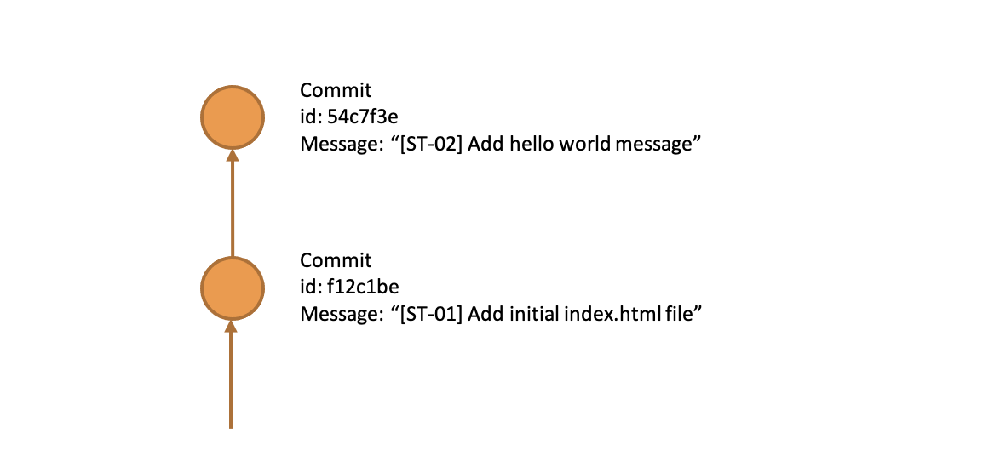
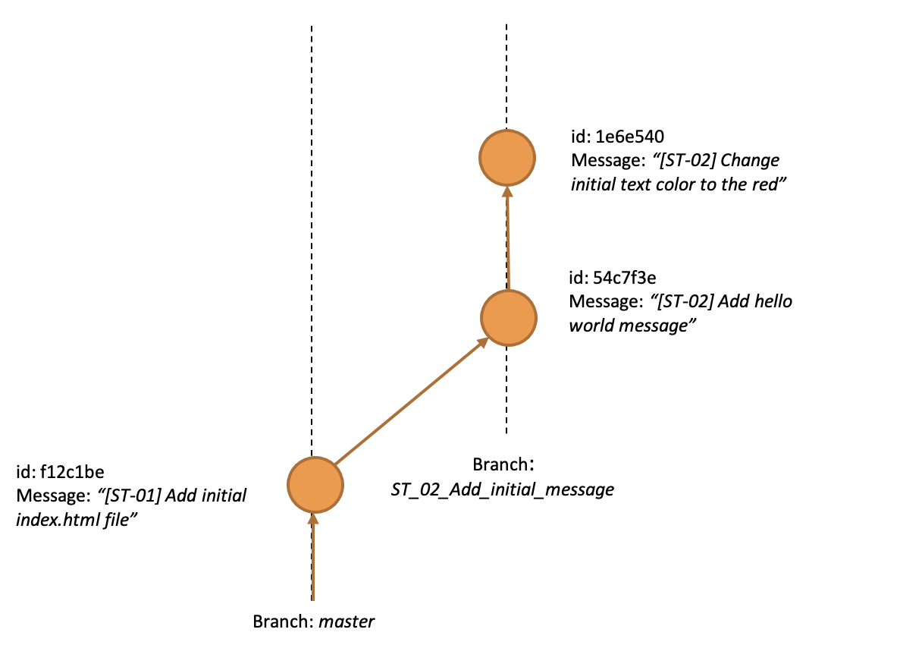
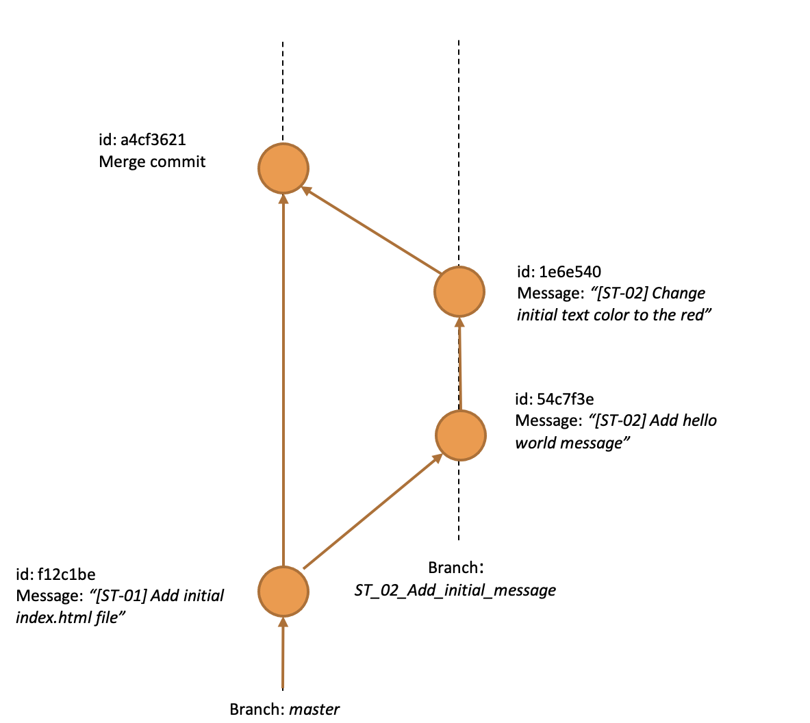
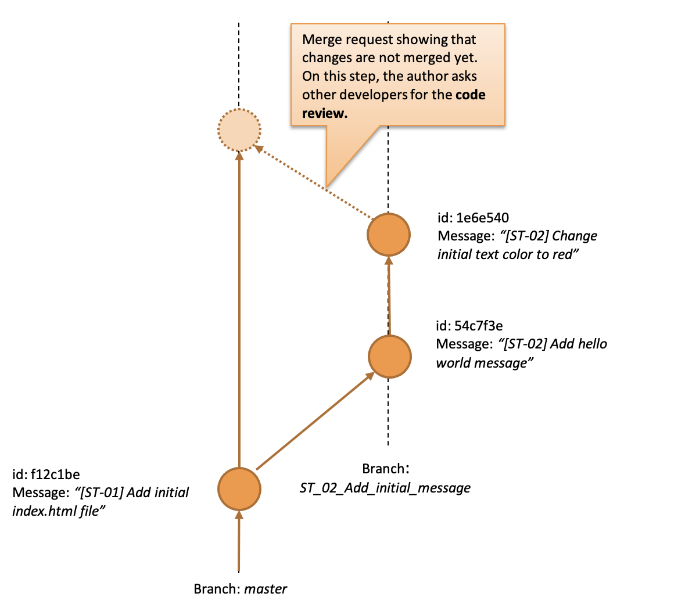
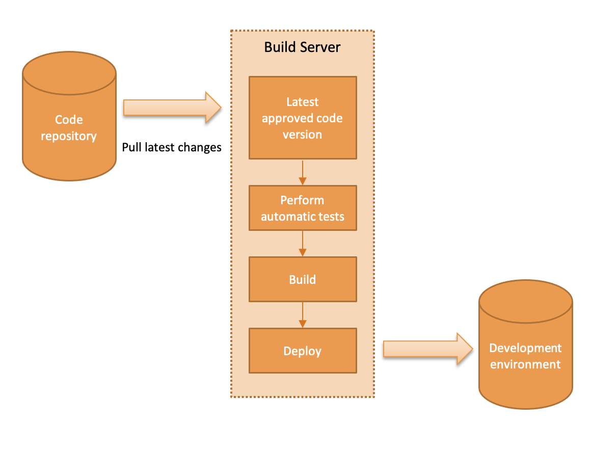
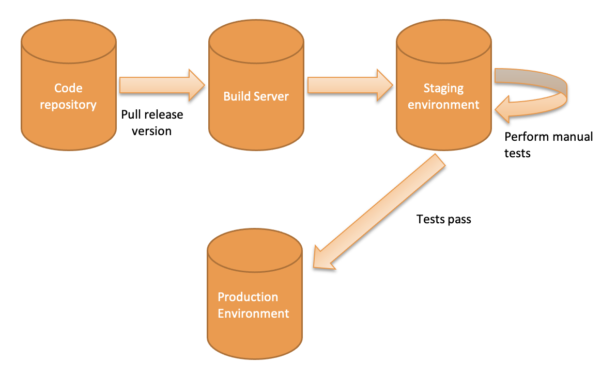

# How do we work?

> A short about how we make software in Sandstream Development for non-technicals.

Many companies handle code and in different ways. Proper code management and standardized continuous integration processes can give many advantages for the customers and the software developers.

In this paper, we will show you how we work, care about the code quality, and give our customers access to the current project status during the whole project lifecycle.

## Code management

Correct code management is an essential part of developers’ work. If it is performed correctly, it allows taking care of product quality at a very early stage of the project.

In our software development process, we use Git as a code repository. Git is a distributed source control management tool that tracks every change made to the codebase. It allows creating and managing multiple code branches, which is very important to our development process.

All code changes are collected into the *commits*. Every *commit* may contain changes to multiple files. *Commits* are identified by a *commit id* and include info explaining what and why has been changed.

In the drawing below, you will find two *commits* performed on the repository. The first one initializes the application (e.g. adds an empty index.html file). The second one modifies that file by adding the “Hello world” message.

*Figure 1 A basic operations performed on the code repository*

Commits typically include code modifications required to complete tasks. In our development process, the commit message usually contains the identifier of the task associated with the task tracking tool (e.g. Jira). It allows us to make integrations between tools and ease tasks tracking.

### Branches

Making all changes in one branch may be difficult to track, and the repository may become messy. It is also hard to review the code and discuss the provided changes.

To avoid these issues, we use branches to improve code readability and change tracking.

In Git every code change is done on a branch. The main branch is commonly named *master* and usually is a root for other branches. Commits shown in Figure 1 are performed on a single branch. *Master* branch typically contain an approved, correctly working code version.

Branches are usually used to prepare and test new features without the need to modify the master branch. They are called *feature branches*.

*Figure 2 A basic example of using branches in Git*

The situation in Figure 2 is similar to the previous one, where there were two subsequent commits divided into two branches. The *master* branch contains the already approved version; the second branch contains code changes required by the new feature. Every branch has its name, indicating the branch’s purpose. In this case, the branch name contains a task id from an external task management tool.

There may be many commits in one branch. All of them should be connected with the branch’s purpose. Example in Figure 3 shows the first commit, which adds a new message, and the second one, which changes the message formatting. Both commits are associated with one task.

*Figure 3 An example of multiple commits in one branch*

When all changes required by the new feature are done and thoroughly reviewed by other developers, the whole branch may be merged into the *master* branch. When a branch is merged, then a new merge commit is created. You can see that in Figure 4.

*Figure 4 An example of multiple commits in one branch*

### Code review

In the previous paragraph, we have shown you the basics of how we manage code during the development process. The next important step in taking care of code quality is code review. During the code review, other developers check the code proposed by the author. Reviewers check if the code meets our quality standards, comply with acceptance criteria, and check the impact on the other application parts.

Code review is done on a feature branch before merging those changes into the *master* branch. It gives a possibility for making appropriate changes before the code goes live to the end-users. You can see that in Figure 5.

*Figure 5 An example of merge request with code review step*

In our daily work, we use tools like [GitHub](https://github.com) and [GitLab](https://gitlab.com), which allows us to handle merge requests, code reviews, and comments easily. You can check this out on our sample public repository: https://github.com/sandstreamdev/eoc.

*Figure 6 An example of a merge request*

When the *merge request* is created, other developers from the team review proposed changes by checking if they meet our **quality standards** and leave their feedback. The number of reviewers depends on the project. In smaller projects, all team members review the proposed changes.

If some issues were found, the author of the merge request is asked to provide fixes before merging. Reviewers have to recheck the code when the requested fixes are provided. When everything is ready, the merge request author is allowed to merge his branch into the *master* branch.

Besides the advantages of the proper code quality, all reviewers gain knowledge about upcoming changes. It’s essential, as it removes islands of isolated code maintained only by one developer. When the development team changes, e.g. some developer leaves the project, others can work on all code parts.

### Additional tools

In our work, we use tools to ensure the same code style in the whole project and to avoid easy to find issues. Unit tests and tools for static code analysis (e.g. [Prettier](https://prettier.io/), [ESlint](https://eslint.org/), or [StyleLint](https://stylelint.io/)) are executed before making the commit. If any warnings are reported, the commit is rejected, and the code author has to fix all these issues.

## Continuous Integration and Delivery

Tracking changes and the status of the product under development is a key success factor of delivery. We have constructed our processes to continuously deliver the possibility of checking the current state of the product. It is especially important in the Agile software development process. The customer can see a working version of an application and react fast in the early stages of development. It allows developing an application that better meets the user’s requirements and reduces the costs of further changes.

Continuous integration and delivery processes may vary, depending on the application release state. Below you will find the two generic scenarios, which may be modified depending on the product-specific.

### An application under development, not released yet

According to the previously presented code management workflow, we assume, that changes committed to the *master* branch are reviewed and ready to be delivered to the development environment.

*Figure 7 An example of the continuous integration scenario*

In Figure 7, you can see the basic scenario of continuous integration and delivery. The build server pulls the latest changes from the code repository. In the next steps, the build server runs automatic checks (e.g. unit tests or tools for static code analysis). If that step passes, then it builds the code and deploys a new version of the software to the development environment.

Finally, the development environment contains all changes committed to the *master* branch. The customer can see the development progress with features being under active development. Testers can perform manual tests on the newly implemented features.

### A released application, underdevelopment of the new features

This variant may be used when we are developing new features of the already released app. When the new release is scheduled, a new branch from the master branch is created. It is called a “release branch”. That branch is built on the build server and deployed to the staging server. On the staging server, testers perform regression tests, and if everything is working correctly, then the production is being updated.

*Figure 8 An example of a continuous integration process for released application versions*

## Summary

In this article, we have described the basics of two processes that we use in all our projects. They are crucial in providing good quality of the final product, which fulfills customer’s needs.

Proper code management has a significant impact on code quality. It is also the first step, where we care about the quality of the delivered software.

Correct code management:
* allows issue detection early, before the code hits the main development branch or production deployments,
* guarantees that the code is consistent and written in the same style. It makes code easier to read and maintain. New developers are getting introduced faster,
* make team members familiar with the latest changes.

Continuous integration and delivery give the customer the possibility to keep track of the development status, and request changes. Development results are delivered as fast as it is possible, allowing to introduce of changes at early stages, which reduces costs significantly.

You can check how it works on our company GitHub: https://github.com/sandstreamdev.

## Further reading

* Simple website, “simple setup” — lessons learned (part 1) (Jekyll, Docker, Express.js, Nginx and Jenkins FTW!) — https://medium.com/sandstreamdev/simple-website-simple-setup-lessons-learned-part-1-1942d9e3c960
* Pro Git — https://git-scm.com/book/pl/v2
* Gitflow workflow — https://www.atlassian.com/git/tutorials/comparing-workflows/gitflow-workflow
* Why google stores billions of code in a single repository? — https://cacm.acm.org/magazines/2016/7/204032-why-google-stores-billions-of-lines-of-code-in-a-single-repository/fulltext
* Prettier, the code formatter — https://prettier.io/